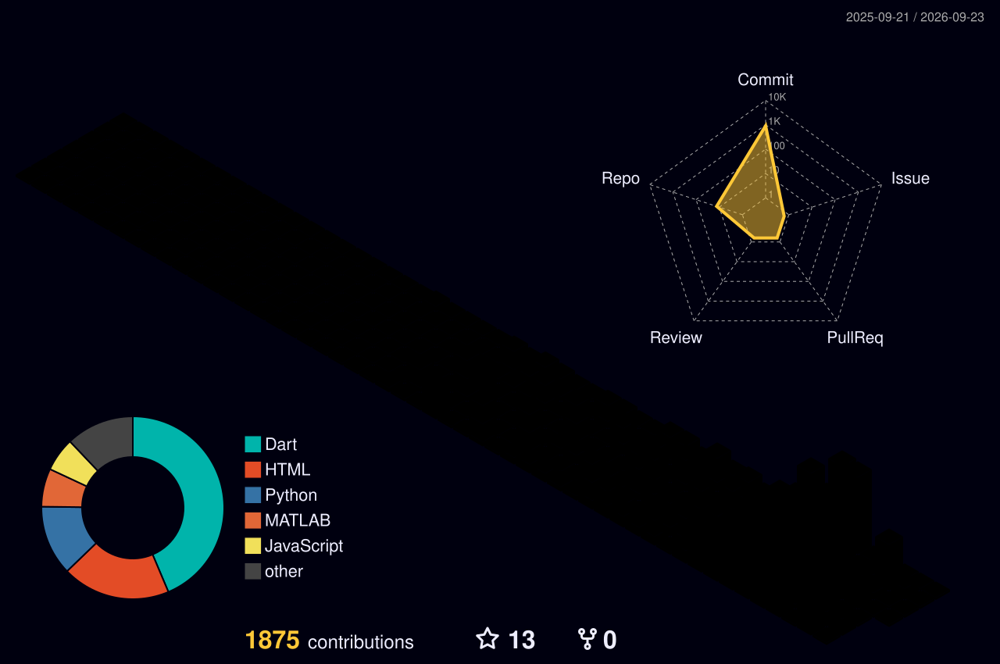
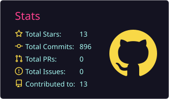
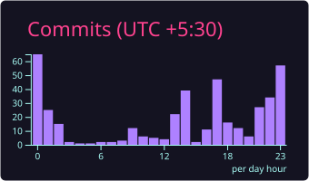
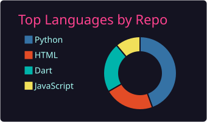
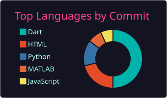

# Hi there, I'm Aman Kumar Singh 👋

  
  
  

---

### 👨‍💻 About Me

* 🔭 Main Project: **Faujiniwas** — Zero-Brokerage Housing for Indian Armed Forces
* 🎓 Pursuing: **Electrical & Electronics Engineering (EEE)** @ **Galgotias College of Engineering and Technology (GCET)**
* 🌱 Exploring: **Embedded Systems, Cybersecurity & Local LLM Deployments** (Ollama + Termux)
* ⚙️ Operating Systems: **Garuda Linux** & **BlackArch**
* 🎭 Member @ **StageX Club**
* ⚡ Fun fact: Pushing mobile hardware limits by hosting local AI models on-device.

---

### 🛠️ Tech Stack & Tools

  

---

### 🚀 Featured Projects

| Project | Description | Stack | Status |
|:---|:---|:---|:---:|
| [**🏠&nbsp;𝓕𝒶𝓊𝒿𝒾𝓃𝒾𝓌𝒶𝓈**](https://github.com/gangasagar5928/faujiniwas) | *Zero-brokerage housing & relocation network for Indian Armed Forces across 62+ military cantonments* | `React 19` `Vite` `Firebase` `Flutter` |  |
| [**🌊&nbsp;𝓥𝒶𝓇𝓊𝓃𝒶-𝒮𝒟𝒮**](https://github.com/gangasagar5928/VARUNA-SDS) | *Software-Defined Subsea Acoustic Waveform Synthesizer with real-time DDS, LFM chirp modulation & 7.6 cm range resolution for AUVs* | `ESP32` `STM32` `C++` `Python` `PlatformIO` |  |
| [**🪖&nbsp;𝓝𝒾𝓇𝒹𝒽𝓋𝒶𝓃𝒾**](https://github.com/gangasagar5928/NIRDHVANI) | *Tactical dual-sensor adaptive noise cancellation comms for extreme battlefield environments using throat-piezo acoustic decoupling & NLMS DSP* | `ESP32` `STM32` `C` `C++` `FreeRTOS` |  |
| [**🕉️&nbsp;𝒟𝒽𝒶𝓇𝓂𝒶&nbsp;𝒟𝒶𝒾𝓁𝓎**](https://github.com/gangasagar5928/Dharma-Daily) | *Offline Vedic Panchang, Sacred Scripture Reader & Spiritual Tradition Guide with 455-day Drik Siddhanta calendar* | `Flutter` `Dart` `Android` |  |
| [**🎙️&nbsp;𝐸𝓁𝑜𝓆𝓊𝒾**](https://github.com/gangasagar5928/Eloqui) | *On-device AI English & IELTS speaking coach running Whisper STT + Llama 1.5B + Piper TTS via C++ FFI* | `Flutter` `Dart` `C++ FFI` `llama.cpp` |  |

---

### 📊 GitHub Analytics

  

 

  
  

 

  
  

---

### 🐍 Contribution Activity

  <picture>
    <source media="(prefers-color-scheme: dark)" srcset="https://raw.githubusercontent.com/gangasagar5928/gangasagar5928/output/github-contribution-grid-snake-dark.svg">
    <source media="(prefers-color-scheme: light)" srcset="https://raw.githubusercontent.com/gangasagar5928/gangasagar5928/output/github-contribution-grid-snake.svg">
    
  </picture>

  

